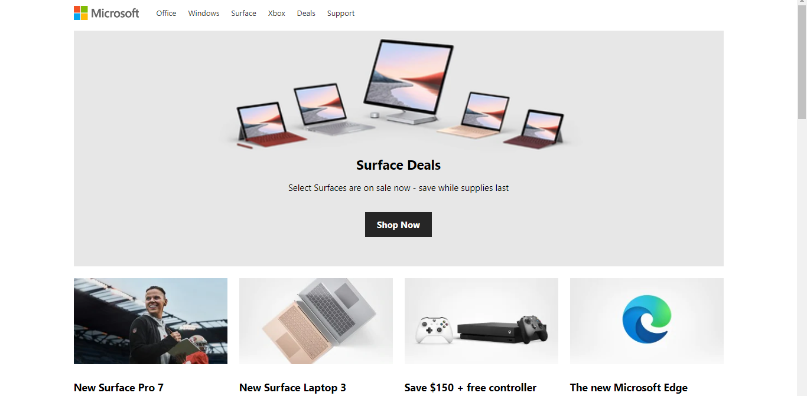
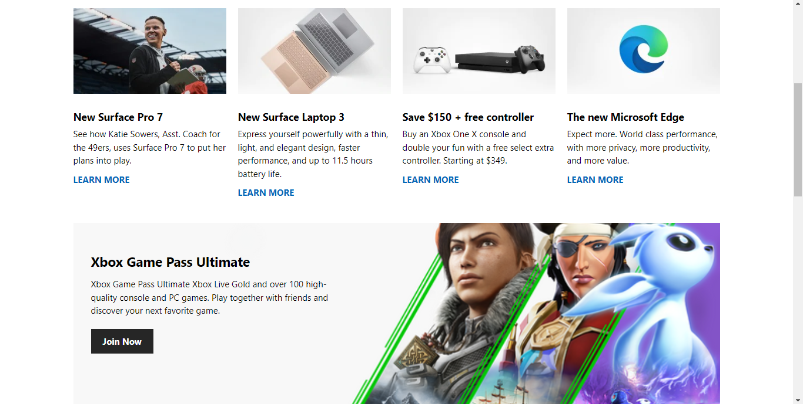
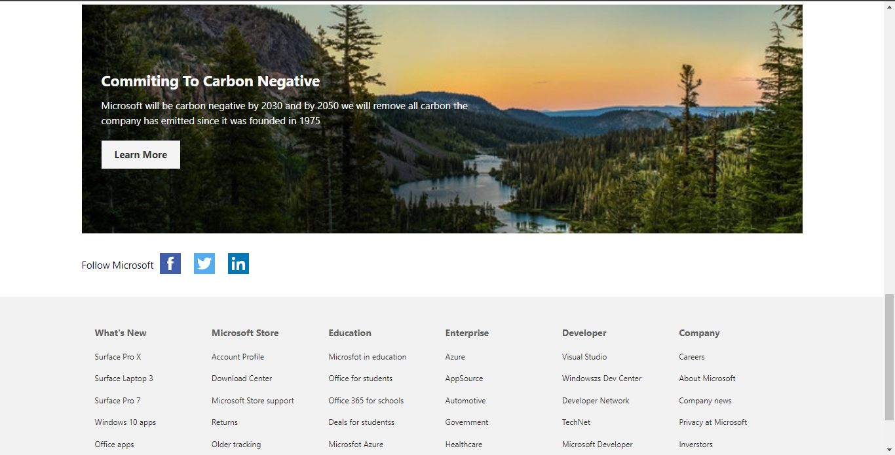

# Microsoft Clone Website


This project is a clone of the Microsoft website's homepage. It replicates the layout and design of Microsoft's official website as of the knowledge cutoff date in September 2021.

## Table of Contents

- [Description](#description)
- [Screenshots](#screenshots)
- [Features](#features)
- [Technologies Used](#technologies-used)
- [Setup](#setup)

## Description

This project is a static HTML and CSS clone of the Microsoft website's homepage. It serves as a demonstration of web development skills and an example of creating responsive and visually appealing web pages.

## Screenshots





## Features

- Responsive design for various screen sizes.
- Navigation menu with dropdown functionality.
- Showcase section with promotional content.
- Home cards showcasing Microsoft products and services.
- Information sections about Xbox, carbon commitment, and social media links.
- Footer with links to various sections of the website.

## Technologies Used

- HTML5
- CSS3
- JavaScript

## Setup

1. Clone the repository to your local machine using `git clone`.

```bash
git clone https://github.com/your-username/microsoft-clone.git
